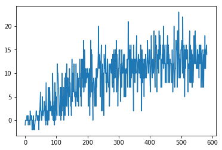
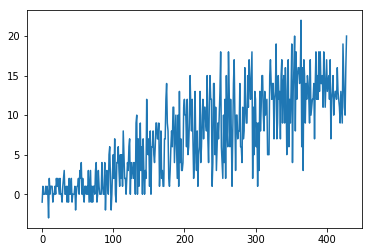

## Project 1 : Navigation

Author : Santosh Shukla

This project is implements Deep Q Network along with fixed Q and experience replay. The deep neural network has following layers:

    Fully connected layer - input: 37 (state size) output: 128
    Fully connected layer - input: 128 output 64
    Fully connected layer - input: 64 output: (action size)

Parameters used in DQN algorithm:

    Maximum steps per episode: 2000
    Starting epsilion: 1.0
    Ending epsilion: 0.1
    Epsilion decay rate: 0.999
The environment is considered as solved if the agent scores an average of 13 over 100 episodes.

Following is how an untrained agent performs in the Unity Environment

When the agent is trained, following is the behavior 

### Graphs

A DQN with experience replay and fixed Q target was implemented, the environment is solved in 582 episodes

A Double DQN algorithm with experience replay and fixed Q target was implemented, the environment is solved in 428 episodes

### Future work
To improve performance try using the following:
- Implement Dueling Q Network
- Prioritized experience replay
